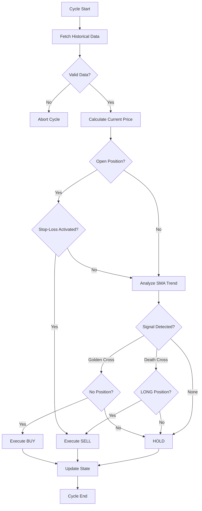

# Sentinel Execution Bot 🎯

## Gold Level | Algorithmic Execution Agent

### Description

The **Sentinel System** is an autonomous trading bot that implements a Simple Moving Average (SMA) crossover strategy with integrated risk management. It operates 24/7 executing buy/sell decisions based on technical analysis, without emotional biases.

### Value Proposition

> "We convert your investment strategy into an autonomous, disciplined, tireless agent. Our Sentinel System will execute your market theses with millisecond precision, 24/7, without fear or greed. Stop missing opportunities due to human limitations and deploy an operator that never sleeps."

### Main Features

✅ **Moving Average Crossover Strategy:**
- **Golden Cross:** Buy signal when short SMA crosses above long SMA
- **Death Cross:** Sell signal when short SMA crosses below long SMA

✅ **Automated Risk Management:**
- **Dynamic Stop-Loss:** Automatic protection against significant losses (configurable, default 5%)
- **Continuous monitoring:** Risk assessment on each execution cycle

✅ **Simulated Order Execution:**
- Detailed logging of all operations
- Complete history with timestamps and execution prices

✅ **Object-Oriented Architecture:**
- Clean, modular, and extensible code
- Type hints for greater security and readability
- Structured logging of all operations

### Use Cases

- **24/7 automated trading:** Capture opportunities while you sleep
- **Elimination of emotional biases:** Decisions based solely on data
- **Strategy backtesting:** Historical performance simulation
- **Multi-asset management:** Deploy multiple bot instances

### Installation

```bash
pip install requests pandas numpy
```

### Usage

```bash
python sniper_bot.py
```

### Configuration

Customize bot parameters when instantiating the `SniperBot` class:

```python
bot = SniperBot(
    symbol="BTC-USD",           # Asset to trade
    short_period=12,            # Short SMA period
    long_period=26,             # Long SMA period
    stop_loss_percentage=0.05,  # Stop loss (5%)
    data_interval_days=30       # Days of historical data
)
```

### Supported Assets

- `BTC-USD` - Bitcoin
- `ETH-USD` - Ethereum
- `SOL-USD` - Solana

### Example Output

```
🎯 Starting Sentinel Execution Bot (Gold Tier)...

2025-11-25 16:30:00 - INFO - SniperBot initialized for BTC-USD with SMA(12, 26) and Stop Loss of 5.00%.
2025-11-25 16:30:01 - INFO - 🔄 Starting trading cycle...
2025-11-25 16:30:02 - INFO - 💰 Current price of BTC-USD: $64,250.00
2025-11-25 16:30:03 - INFO - 🟢 Golden Cross detected: Short SMA crosses above Long SMA.
2025-11-25 16:30:03 - INFO - 📝 Order executed: BUY at $64,250.00
2025-11-25 16:30:03 - INFO - Current position: LONG

================================================================================
ORDER HISTORY
================================================================================
1. BUY | Price: $64,250.00 | Timestamp: 2025-11-25 16:30:03
================================================================================

✅ Sentinel System executed successfully.
```

### Code Architecture

```
sniper_bot.py
├── TradingSignal (Enum)       # Signals: BUY, SELL, HOLD
├── Position (Enum)            # States: NONE, LONG
└── SniperBot (Class)
    ├── __init__()             # Initialization and configuration
    ├── _fetch_historical_data()  # Data download (CoinGecko API)
    ├── analyze_trend()        # SMA analysis and crossover detection
    ├── manage_risk()          # Stop-loss evaluation
    ├── execute_order()        # Order simulation
    ├── execute_cycle()        # Complete trading cycle
    └── show_history()         # Operations report
```

### Execution Flow



### Possible Extensions

**Level 1 - Immediate Improvements:**
- Integration with real exchanges (Binance, FTX, Kraken)
- Push notifications (Telegram, Email, SMS)
- Real-time web dashboard

**Level 2 - Optimization:**
- Multiple strategies (RSI, MACD, Bollinger Bands)
- Parameter optimization via grid search
- Backtesting with extensive historical data

**Level 3 - Advanced AI:**
- Integration with Machine Learning models
- Reinforcement Learning for strategy optimization
- News/social media sentiment analysis

### Risk Management

> ⚠️ **IMPORTANT:** This bot is configured in SIMULATION mode. Before deploying in production with real capital:
> - Perform exhaustive backtesting with historical data
> - Test in paper trading environments for at least 30 days
> - Implement global circuit breakers
> - Define daily/weekly/monthly loss limits
> - Establish 24/7 monitoring alerts

### Next Steps

This Gold module is ideal for:
- **Validating strategies:** Testing trading hypotheses before risking capital
- **Scaling to Platinum level:** Integrating into the complete Hedge Fund architecture
- **Customization:** Developing variants for different asset classes

---

**Part of the Hedge Fund Core ecosystem | Algorithmic Trading Architecture**
