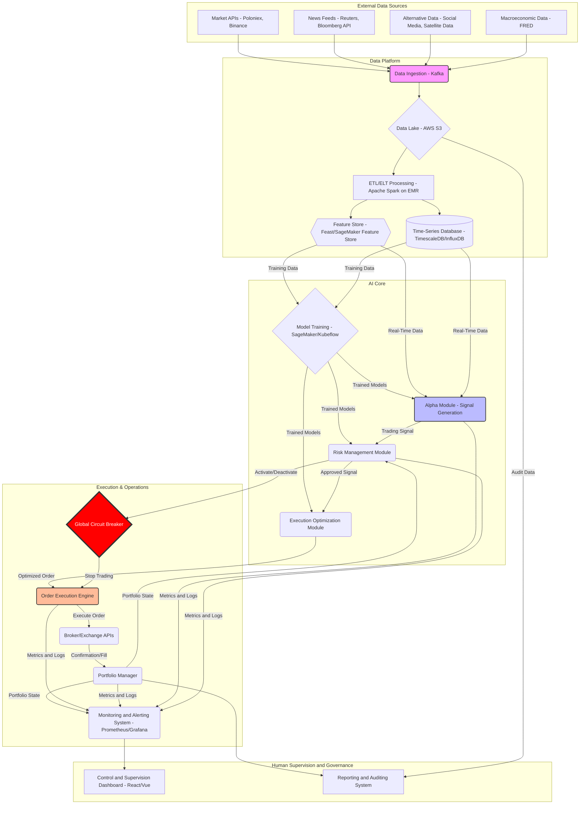

# Technical Architecture: Autonomous Hedge Fund (Platinum Tier)

| **Version** | **Author** | **Date** | **Status** |
| :--- | :--- | :--- | :--- |
| 1.0 | Senior Software Architect | 2025-11-25 | Technical Document |

## 1. Executive Summary

This document details the technical architecture for an **Autonomous Hedge Fund**, a high-frequency algorithmic trading platform based on artificial intelligence. The goal is to create a system that can operate autonomously 24/7, from data ingestion and hypothesis generation (alpha) to order execution and risk management, with minimal human intervention focused on strategic supervision.

The architecture is based on the following key principles:

- **Event-Driven Architecture (EDA):** To react in real-time to market changes.
- **Microservices:** For modularity, independent scalability, and resilience.
- **Security by Design:** Integrating security into every layer of the architecture.
- **Cloud-Native:** Leveraging the elasticity, resilience, and managed services of the cloud (AWS).
- **Data-Centric:** Data is the most valuable asset; the entire system revolves around its capture, processing, and exploitation.

---

## 2. Data Flow Diagram (General Architecture)

The following Mermaid diagram illustrates the data flow and interaction between the main system components.

---

## 3. Detailed Technology Stack

| Component | Proposed Technology | Justification |
| :--- | :--- | :--- |
| **Cloud Provider** | Amazon Web Services (AWS) | Mature ecosystem, robust managed services (SageMaker, EKS, MSK, S3) and high availability. |
| **Infrastructure as Code (IaC)** | Terraform, AWS CDK | Infrastructure automation, reproducibility and environment version control. |
| **Containers and Orchestration**| Docker, Kubernetes (AWS EKS) | Standard for microservices. Scalability, resilience and portability. |
| **Messaging / Event Bus** | Apache Kafka (AWS MSK) | Managing high-frequency real-time data streams. Decouples producers and consumers. |
| **Data Lake** | AWS S3 + AWS Lake Formation | Low-cost, scalable and durable storage for raw and processed data. |
| **Data Processing** | Apache Spark (AWS EMR) | Large-scale distributed processing for complex ETLs and feature engineering. |
| **Time-Series Database** | TimescaleDB (on RDS) or InfluxDB | Optimized for high-speed queries on time series data (prices, volumes). |
| **Transactional Database**| PostgreSQL (AWS RDS) | Reliable storage for portfolio state, orders, configurations and metadata. |
| **Feature Store** | AWS SageMaker Feature Store / Feast | Centralizes, versions and serves features for training and inference, avoiding *training-serving skew*. |
| **Programming Languages** | **Python:** AI/ML, Data Science **Go/Rust:** Low-latency microservices (Execution) **TypeScript:** Frontend | Polyglot approach. Choose the best tool for each task. Python for its AI ecosystem. Go/Rust for performance and concurrency. |
| **AI/ML Frameworks** | PyTorch, TensorFlow, Scikit-learn, XGBoost | Industry standards with broad community support and production tools. |
| **MLOps** | MLflow, AWS SageMaker Pipelines | For model versioning, experiment tracking and automation of model lifecycle. |
| **Monitoring and Logging** | Prometheus, Grafana, OpenTelemetry, ELK Stack | Complete system observability: metrics, distributed logs and visualizations. |
| **Frontend** | React / Vue.js with Next.js/Nuxt.js | Rapid development of interactive and responsive dashboards for supervision. |
| **Secrets Management** | AWS Secrets Manager / HashiCorp Vault | Secure storage and rotation of credentials, API keys and certificates. |

---

## 4. Artificial Intelligence Modules (AI Core)

The system's "brain" consists of several interconnected AI modules that collaborate to make trading decisions.

### 4.1. Alpha Module (Signal Generation)

**Function:** Identify patterns and predict price movements to generate buy/sell signals (alpha).

**Models:**
- **Time Series Models:** LSTMs, GRUs, Transformers (for price and volume sequences)
- **Natural Language Processing (NLP) Models:** Transformer-based models (e.g., FinBERT) to analyze news, tweets and financial reports, extracting sentiment and key events
- **Graph Neural Networks (GNN):** To analyze relationships between different assets and shock propagation in the market
- **Reinforcement Learning (RL) Models:** An agent (e.g., PPO, A2C) that learns an optimal trading policy by interacting with a simulated market environment

### 4.2. Risk Management Module

**Function:** Assess the risk of each trading signal and the complete portfolio before executing orders.

**Components:**
- **VaR (Value at Risk) Calculation:** Estimation of potential losses
- **Correlation Analysis:** Identification of concentrated exposures
- **Position Limits:** Enforcement of limits by asset, sector and total portfolio
- **Scenario Simulation (Stress Testing):** Assessment of impact of extreme events

### 4.3. Execution Optimization Module

**Function:** Determine the best way to execute an order to minimize market impact (slippage) and transaction costs.

**Techniques:**
- **Execution Algorithms (TWAP, VWAP, Implementation Shortfall)**
- **Liquidity Prediction:** Order book analysis
- **Smart Order Routing:** Routing to multiple venues

---

## 5. Security and Compliance

### 5.1. Security Layers

- **Network Security:** Isolated VPC, Security Groups, NACLs
- **Application Security:** MFA authentication, RBAC (Role-Based Access Control)
- **Data Security:** Encryption in transit (TLS 1.3) and at rest (AES-256)
- **Secrets Management:** Automatic credential rotation, principle of least privilege

### 5.2. Auditing and Compliance

- **Immutable Logs:** All operations recorded on S3 with Object Lock
- **Anomaly Alerts:** Detection of suspicious patterns
- **Regulatory Reporting:** Automatic generation of reports for regulatory entities

---

## 6. Scalability and Resilience

### 6.1. Scalability Strategies

- **Horizontal Scaling:** Auto-scaling of pods in Kubernetes based on metrics (CPU, memory, latency)
- **Data Sharding:** Data partitioning in TimescaleDB by symbol and date
- **Caching:** Redis/ElastiCache for frequently accessed data

### 6.2. High Availability

- **Multi-AZ Deployment:** Geographic redundancy in AWS
- **Automated Health Checks:** Kubernetes liveness/readiness probes
- **Circuit Breakers:** Prevention of failure cascades (Hystrix pattern)
- **Disaster Recovery:** Automatic backups, RTO < 1 hour, RPO < 15 minutes

---

## 7. Implementation Roadmap

### Phase 1: MVP (3-4 months)

- [ ] Functional data core (Kafka + S3 + TimescaleDB)
- [ ] First alpha generation model (simple strategy)
- [ ] Basic execution bot (Silver + Gold tier integrated)
- [ ] Monitoring dashboard

### Phase 2: Production (3-4 months)

- [ ] Multiple parallel alpha strategies
- [ ] Complete risk management module
- [ ] Integration with multiple exchanges
- [ ] 24/7 alerting system

### Phase 3: Optimization (3-6 months)

- [ ] Advanced AI models (RL, Transformers)
- [ ] Complete feature store
- [ ] Automated MLOps pipeline
- [ ] Real-time sentiment analysis

---

## 8. Success Metrics

### Operational KPIs

- **Uptime:** > 99.9%
- **Execution Latency:** < 100ms (P99)
- **Signal Accuracy:** > 60% win rate
- **Sharpe Ratio:** > 1.5

### Business KPIs

- **Annual Return:** Target > 20%
- **Maximum Drawdown:** < 15%
- **Generated Alpha:** Performance above benchmark

---

## 9. Conclusion

This architecture represents a **next-generation investment system**, combining the best of human strategy with the power of algorithmic execution. It is scalable, resilient, secure and designed to operate in the most demanding environment: global financial markets.

The modular approach allows incremental implementation, starting with the Silver and Gold modules (already implemented in this repository) and progressively scaling toward the complete Platinum architecture.

---

**© 2025 Hedge Fund Core | Algorithmic Trading Architecture**
